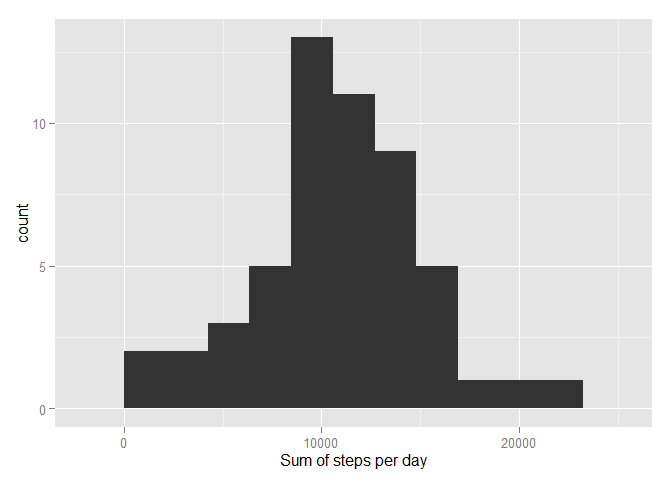
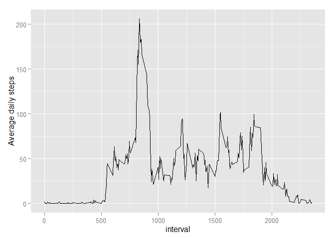
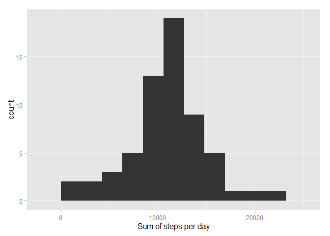
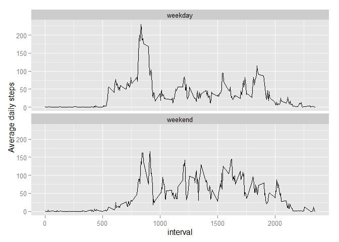

# Reproducible Research: Peer Assessment 1


## Loading and preprocessing the data  
("activity.zip" must be in the working directory")


```r
if (!file.exists("activity.csv")){
    unzip(zipfile = "activity.zip")
}

##load data to activityData
activityData<-read.csv("activity.csv",stringsAsFactors = FALSE)

##change 'date' from character to date format
activityData$date<-as.Date(x = activityData$date, format="%Y-%m-%d")
```

## What is mean total number of steps taken per day?  
1. Calculate the total number of steps taken per day


```r
suppressPackageStartupMessages(
    library (dplyr)
    )
##using dplyr package, activityData is grouped by 'date' and summarise() function calculates the sum of steps for each date-group.

stepsDay<-group_by(.data = activityData, date)%>%
    summarise(Steps=sum(steps))
```

2. Make a histogram of the total number of steps taken each day


```r
suppressPackageStartupMessages(
    library (ggplot2)
    )
##then an histogram is built according to instructions
ran<-range (stepsDay$Steps, na.rm=TRUE)
plot1<-ggplot (data = stepsDay,aes(Steps))+
    geom_bar(stat="bin", binwidth=diff(ran)/10)+
    xlab("Sum of steps per day")
print (plot1)
```

 

3. Calculate and report the mean and median of the total number of steps taken per day


```r
cat ("mean of the total steps per day:", mean(stepsDay$Steps, na.rm=TRUE))
```

```
## mean of the total steps per day: 10766.19
```

```r
cat ("median of the total steps per day:", median(stepsDay$Steps, na.rm=TRUE))
```

```
## median of the total steps per day: 10765
```


## What is the average daily activity pattern?  

1. Make a time series plot (i.e. type = "l") of the 5-minute interval (x-axis) and the average number of steps taken, averaged across all days (y-axis)


```r
##using dplyr package, activityData is grouped by 'interval' and summarise() function  calculates the mean of steps for each interval-group (across all days).


steps5min<-group_by(.data = activityData, interval)%>%
    summarise(Steps=mean(steps, na.rm=T))
##then a line plot is created according to instructions
plot2<-ggplot(steps5min, aes(x=interval,y=Steps))+
    geom_line()+
    ylab("Average daily steps")

print (plot2)
```

 

2. Which 5-minute interval, on average across all the days in the dataset, contains the maximum number of steps?


```r
intervalMaxSteps<-with(steps5min,
                       which (Steps==max(Steps,na.rm=TRUE)))
cat("The 5-min interval that contains the maximum number of steps averaged accross all days is:",
    steps5min$interval[intervalMaxSteps])
```

```
## The 5-min interval that contains the maximum number of steps averaged accross all days is: 835
```


## Imputing missing values  

1. Calculate and report the total number of missing values in the dataset (i.e. the total number of rows with NAs)

```r
nas<-sum (is.na(activityData))

cat ("The total number of rows with missing values is:", nas, sep=" ")
```

```
## The total number of rows with missing values is: 2304
```

2. Devise a strategy for filling in all of the missing values in the dataset. The strategy does not need to be sophisticated. For example, you could use the mean/median for that day, or the mean for that 5-minute interval, etc.

```
I decided to replace NA with mean of 'steps' grouped by 'interval' stored in 'steps5min' data.frame.
```

3. Create a new dataset that is equal to the original dataset but with the missing data filled in.


```r
##First a 'activityData' is copied in a new dataframe ('activityDataWoNA')
activityDataWoNA<-activityData

##A loop looks for NAs in 'steps' column in the new dataframe and replace them with the mean values of steps across dates for each 'interval'
for (i in 1:nrow(activityDataWoNA)){
    if(is.na(activityDataWoNA$steps[i])){
        interval<-activityDataWoNA$interval[i]
        activityDataWoNA$steps[i]<-steps5min$Steps[steps5min$interval==interval]    
    }
}
```

4. Make a histogram of the total number of steps taken each day and Calculate and report the mean and median total number of steps taken per day. Do these values differ from the estimates from the first part of the assignment? What is the impact of imputing missing data on the estimates of the total daily number of steps?

```r
##creates a dataframe with total number of steps per day
stepsDayWoNA<-group_by(.data = activityDataWoNA,date)%>%
    summarise(Steps=sum(steps))

##then an histogram is built according to instructions
ran<-range (stepsDayWoNA$Steps, na.rm=TRUE)
plot3<-ggplot (data = stepsDayWoNA,aes(Steps))+
    geom_bar(stat="bin", binwidth=diff(ran)/10)+
    xlab("Sum of steps per day")
print(plot3)
```

 

```r
cat ("mean of the total steps per day (after imputing Nas):", mean(stepsDayWoNA$Steps))
```

```
## mean of the total steps per day (after imputing Nas): 10766.19
```

```r
cat ("median of the total steps per day (after imputing Nas):", median(stepsDayWoNA$Steps))
```

```
## median of the total steps per day (after imputing Nas): 10766.19
```

```
Imputing missing data with the mean of each 'interval' did not affect the mean of daily steps (with original data: 10766.19 and after imputing: 10766.19). 
However, the median of the daily steps was slightly different (with original data: 10765 and after imputing: 10766.19). 

```

## Are there differences in activity patterns between weekdays and weekends?

1. Create a new factor variable in the dataset with two levels – “weekday” and “weekend” indicating whether a given date is a weekday or weekend day.


```r
activityDataWoNA$week_dayNumber<-as.POSIXlt(activityDataWoNA$date)$wday
activityDataWoNA<-mutate (activityDataWoNA, 
                          week_day=
                              ifelse(week_dayNumber==0|week_dayNumber==6,
                                     "weekend",
                                     "weekday"
                                     ))
```

2. Make a panel plot containing a time series plot (i.e. type = "l") of the 5-minute interval (x-axis) and the average number of steps taken, averaged across all weekday days or weekend days (y-axis). See the README file in the GitHub repository to see an example of what this plot should look like using simulated data.


```r
##using dplyr package, activityDataWoNa is grouped by 'interval' and summarise() function  calculates the mean of steps for each interval-group (across all days).


steps5minWoNA<-group_by(.data = activityDataWoNA, interval, week_day)%>%
    summarise(Steps=mean(steps, na.rm=T))

##then a line plot is created according to instructions
plot4<-ggplot(steps5minWoNA, aes(x=interval,y=Steps))+
    geom_line()+
    facet_wrap(facets = ~week_day,nrow = 2)+
    ylab("Average daily steps")

print (plot4)
```

 
